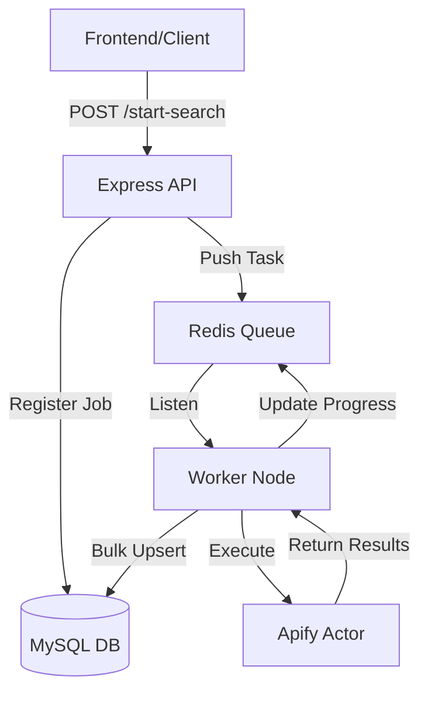

# 
🎯 Lead Generation Engine

  
  
  
  
  

---

## 💎 Overview
A multi-threaded, high-performance microservice specialized in **automated lead extraction**, **data enrichment**, and **intelligent classification**. This engine powers the SROHUB ecosystem by handling heavy cloud-scraping workloads asynchronously.

### ⚡ Key Capabilities
- **Non-Blocking Architecture**: Jobs are offloaded to background workers via Redis.
- **Deduplication Engine**: Multi-vector business matching to ensure database integrity.
- **Apify Integration**: Pre-built connectors for Google Maps and Web Scrapers.
- **Real-time Monitoring**: Progress tracking and status updates via BullMQ events.

---

## 🏗️ System Architecture

---

## 📡 API Specification (A to Z)

### 🚀 Job Orchestration
#### `POST /api/search/start`
Starts a new lead extraction pipeline.

| Parameter | Type | Required | Description |
| :--- | :--- | :--- | :--- |
| `searchId` | `UUID` | Yes | Unique session identifier. |
| `keyword` | `String` | Yes | Business category (e.g., "Dental Clinic"). |
| `city` | `String` | Yes | Geographical target. |
| `limit` | `Number` | No | Results cap (Default: 50). |

#### `GET /api/search/status/:jobId`
Returns the status monitor for the current session.

---

## 🛠️ Technical Stack Breakdown

> [!IMPORTANT]
> This service requires a running **Redis** instance to manage the job queue.

- **Backend Logic**: Node.js & Express
- **Data Persistence**: Sequelize ORM (MySQL 8.0+)
- **Queue Orchestration**: BullMQ (Job priority, retries, and backoff)
- **Scraping Infrastructure**: Apify Platform SDK
- **Logging & Diagnostics**: Winston Logger + Daily Rotation

---

*Part of the SROHUB Intelligent Ecosystem*
